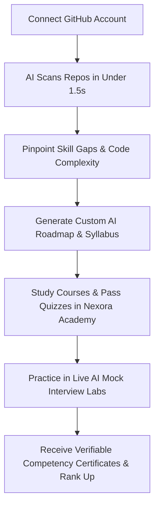

# 🎨 Nexora — Landing Page Design Specification & Implementation Plan

This document details the premium SaaS design system and implementation plan for the **Nexora** landing page. It merges the modern minimalist visual aesthetics of platforms like *Linear*, *Vercel*, *Stripe*, and *Cursor* with the actual features, directories, and codebases of the **Nexora** project.

---

## 🛠️ Unified Technology Stack

To remain fully compatible with the existing Nexora workspace, the landing page is built using:
* **Core Framework**: React 19 + Vite 8 (replacing Next.js to match Nexora's active single-page router).
* **Router**: `react-router-dom` v7 (used in [App.jsx](file:///c:/Users/krisha%20pore/OneDrive/Desktop/Nexora/Nexora/frontend/src/App.jsx)).
* **Styling**: TailwindCSS 4 (using `@tailwindcss/vite` in [vite.config.js](file:///c:/Users/krisha%20pore/OneDrive/Desktop/Nexora/Nexora/frontend/vite.config.js)).
* **Animations**: `framer-motion` (for smooth physics-based transitions, lifts, and staggers).
* **Icons**: `lucide-react`.
* **Interactive Editor**: Monaco Editor (via `@monaco-editor/react` in coding sandbox features).

---

## 🎨 Premium SaaS Design System

### 1. Global CSS Color tokens
These tokens are defined as CSS variables in [index.css](file:///c:/Users/krisha%20pore/OneDrive/Desktop/Nexora/Nexora/frontend/src/index.css):

```css
:root {
  --bg-primary: #FCFCFD;
  --text-primary: #111827;
  --text-muted: #6B7280;
  
  /* Brand Gradients & Accents */
  --color-primary: #6366F1;     /* Indigo */
  --color-secondary: #8B5CF6;   /* Purple */
  --color-accent: #06B6D4;      /* Cyan */
  --color-success: #10B981;     /* Emerald */
  
  /* Glassmorphism System */
  --glass-bg: rgba(255, 255, 255, 0.55);
  --glass-border: rgba(255, 255, 255, 0.25);
  --glass-shadow: 0 8px 32px 0 rgba(31, 38, 135, 0.05);
}
```

### 2. Editorial Typography
* **Headings**: `Playfair Display` (Semi-bold / Weight 600) — delivers an editorial, premium publishing feel for hero headings.
* **Body / UI Elements**: `Inter` (Regular, Medium, Semi-bold) — offers sleek, highly readable developer-oriented text.

### 3. Page Background Layout
* **Grid Overlay**: A subtle CSS linear-gradient background grid with a `6%` opacity overlay.
* **Ambient Lighting (Radial Blobs)**: Four large, blurred absolute-positioned circles in background layers:
  * *Top-Left*: Blue (`rgba(99, 102, 241, 0.25)`)
  * *Top-Right*: Purple (`rgba(139, 92, 246, 0.25)`)
  * *Bottom-Left*: Cyan (`rgba(6, 182, 212, 0.25)`)
  * *Bottom-Right*: Pink (`rgba(244, 63, 94, 0.25)`)
  * *Blur Radius*: `150px`

---

## 🧭 Page Section Specifications

### 1. Sticky Glass Navbar
* **Layout**: Centered floating container (`width: 92%`, `max-width: 1400px`, `height: 72px`, `border-radius: 9999px`).
* **Styling**: Sticky on scroll, background: `var(--glass-bg)`, backdrop-filter: `blur(20px)`, border: `1px solid var(--glass-border)`, shadow: `var(--glass-shadow)`.
* **Brand Identity**: **Nexora** typography.
* **Navigation Links**: 
  * Features $\rightarrow$ anchor link to `#features`
  * How it Works $\rightarrow$ anchor link to `#how-it-works`
  * Roadmap $\rightarrow$ redirects to `/roadmap` (auth-protected)
  * Academy $\rightarrow$ redirects to `/roadmap` (academy subset)
  * Challenges $\rightarrow$ redirects to `/challenges`
* **CTA Button**: "Get Started" (Styling: Indigo-to-Cyan gradient, rounded pill, lift and glow hover animation).

### 2. Centered Hero Section
* **Badge**: A micro-floating badge "The Developer Growth Ecosystem" with a pulsing green indicator.
* **Headline**: "Accelerate your **developer career** with an AI mentor that actually reads your code."
  * Uses `Playfair Display` font.
  * Typography size: `90px` on desktop, `48px` on mobile.
  * "**developer career**" wrapped in a CSS gradient (`bg-gradient-to-r from-indigo-500 via-purple-500 to-cyan-500 bg-clip-text text-transparent`).
* **Description**: A centered, legible description (`max-width: 720px`) matching the platform's core pitch:
  * *"Nexora combines deep GitHub code reviews, personalized AI roadmaps, interactive learning, mock interviews, and competency certifications into one intelligent platform that helps developers continuously grow."*
* **Primary CTA**: "Start Free with GitHub" button displaying a GitHub icon. Styled with an indigo-to-purple gradient, hover lift (+2px translate), and radial glow drop-shadow.
* **Secondary CTA**: "See how it works" leading to `#how-it-works` with a chevron indicator.

### 3. Hero Dashboard Preview
Below the hero, a floating dashboard mockup renders realistic platform state:
* **Sidebar Layout**: Reflects actual Nexora modules: *Dashboard, GitHub Scanner, AI Roadmaps, Academy Courses, Interview Lab, Progress Hub, Settings*.
* **Greeting**: *"Welcome back, Alex 👋"*
* **Interactive Widgets**:
  * *Circular Progress Tracker*: Renders `72%` progress.
  * *Radar Skill Competency Chart*: Renders System Design, DevOps, Frontend, Backend, DSA, Cloud.
  * *GitHub Analytics Widget*: Displays overall **Code Health Score** (e.g. `87/100`), scan duration (`1.2s`), and commit metrics.
  * *Active Streak & XP*: Current level rank ("Builder"), `1,850 XP`, and `7-Day learning streak`.
  * *Certifications Banner*: Earned credential preview (e.g., *"Subject Competency in System Design"*).

---

## ⚡ Feature Card Grid (Aligned with Nexora Core Apps)

The landing page features exactly six glassmorphism cards representing the active apps in the [backend/](file:///c:/Users/krisha%20pore/OneDrive/Desktop/Nexora/Nexora/backend) directory:

1. **AI GitHub Reviews (GitHub Health Scoring)**
   * *Icon*: `Code2`
   * *Description*: Connect your GitHub profile to scan your public repositories in under 1.5 seconds. Evaluates language ratios, tests coverage, repository complexity, and commit frequency to generate a detailed Code Health Score.
   * *Real Code Route*: [CodeReviewPage.jsx](file:///c:/Users/krisha%20pore/OneDrive/Desktop/Nexora/Nexora/frontend/src/pages/CodeReviewPage.jsx) / [code_review_engine.py](file:///c:/Users/krisha%20pore/OneDrive/Desktop/Nexora/Nexora/backend/core/code_review_engine.py)

2. **Custom AI Learning Roadmaps**
   * *Icon*: `Zap`
   * *Description*: Analyzes weak areas in your profile and Connected GitHub metrics to generate a custom multi-week learning path generated by AI (Groq LLaMA 3 / Gemini).
   * *Real Code Route*: [RoadmapPage.jsx](file:///c:/Users/krisha%20pore/OneDrive/Desktop/Nexora/Nexora/frontend/src/pages/RoadmapPage.jsx) / [roadmap/models.py](file:///c:/Users/krisha%20pore/OneDrive/Desktop/Nexora/Nexora/backend/roadmap/models.py)

3. **Interactive Academy & Graded Quizzes**
   * *Icon*: `BookOpen`
   * *Description*: Tapping any roadmap task opens a dedicated tutorial course module with system architecture diagrams and code blocks. Passing a 5-question graded quiz completes the topic.
   * *Real Code Route*: [RoadmapLearnPage.jsx](file:///c:/Users/krisha%20pore/OneDrive/Desktop/Nexora/Nexora/frontend/src/pages/RoadmapLearnPage.jsx)

4. **AI Mock Interview Lab**
   * *Icon*: `MessageSquare`
   * *Description*: Simulates real-time interactive technical or HR interviews (FAANG SWE, Frontend, DevOps, Product, etc.). Reviews chat logs, generates detailed feedback lists, and awards XP.
   * *Real Code Route*: [InterviewSessionPage.jsx](file:///c:/Users/krisha%20pore/OneDrive/Desktop/Nexora/Nexora/frontend/src/pages/InterviewSessionPage.jsx)

5. **Skill Analytics & Developer Rank**
   * *Icon*: `BarChart2`
   * *Description*: Tracks your journey from *Explorer $\rightarrow$ Builder $\rightarrow$ Creator $\rightarrow$ Architect $\rightarrow$ Legend*. Log daily activities, XP charts, and monitor competencies.
   * *Real Code Route*: [ProgressPage.jsx](file:///c:/Users/krisha%20pore/OneDrive/Desktop/Nexora/Nexora/frontend/src/pages/ProgressPage.jsx) / [progress/models.py](file:///c:/Users/krisha%20pore/OneDrive/Desktop/Nexora/Nexora/backend/progress/models.py)

6. **Verified Competency Certifications**
   * *Icon*: `Trophy`
   * *Description*: Complete learning modules to earn downloadable Subject Competency Certificates with a unique platform-verifiable certificate ID (e.g. `NXR-E3A5B876`).
   * *Real Code Route*: [utils.py](file:///c:/Users/krisha%20pore/OneDrive/Desktop/Nexora/Nexora/backend/progress/utils.py)

---

## 🔄 User Journey: How it Works

The page details the interactive flow using an animated vertical timeline:



---

## 📈 Interactive Roadmap Tracker Preview
An interactive nodes module is embedded below the analytics block. It showcases the 7 key engineering tracks available in Nexora:
* **Frontend** (React, Vite, CSS layouts)
* **Backend** (Django, REST APIs, Databases)
* **AI & Data Science** (Groq clients, Prompt optimization)
* **Cloud & Networking** (JWT Auth, CDN deployments)
* **DevOps** (Docker setup, GitHub Actions)
* **DSA** (Algorithms, Array manipulations)
* **System Design** (Microservices, Load balancers)

*Visual styling*: Node points glow when hovered or clicked, simulating node progression on the actual learning track page ([RoadmapPage.jsx](file:///c:/Users/krisha%20pore/OneDrive/Desktop/Nexora/Nexora/frontend/src/pages/RoadmapPage.jsx)).

---

## 🎬 Elegant Animations (Framer Motion Tokens)

These standard animation configuration tokens are shared across the page:

```javascript
// Fade Up animation for cards and text blocks
export const fadeUp = {
  hidden: { opacity: 0, y: 30 },
  visible: { 
    opacity: 1, 
    y: 0, 
    transition: { duration: 0.6, ease: [0.16, 1, 0.3, 1] } 
  }
};

// Layout container stagger utility
export const staggerContainer = {
  hidden: { opacity: 0 },
  visible: {
    opacity: 1,
    transition: {
      staggerChildren: 0.1
    }
  }
};

// Subtle hovering float movement for background blobs and preview cards
export const floatingMovement = {
  animate: {
    y: [0, -12, 0],
    transition: {
      duration: 6,
      repeat: Infinity,
      ease: "easeInOut"
    }
  }
};
```

---

## 🏁 Final Call to Action & Footer
* **Call to Action Section**:
  * Background: Glowing light radial blur centered on the section.
  * Headline: *"Ready to become the developer companies actually want?"*
  * Button: *"Start Free with GitHub"* (Glows, lifts, redirects to registration).
* **Footer**:
  * Renders a clean grid featuring **Nexora** branding, platform links (Challenges, Roadmaps, Academy, Profiles), social icons, and an email newsletter subscription input for developers.
