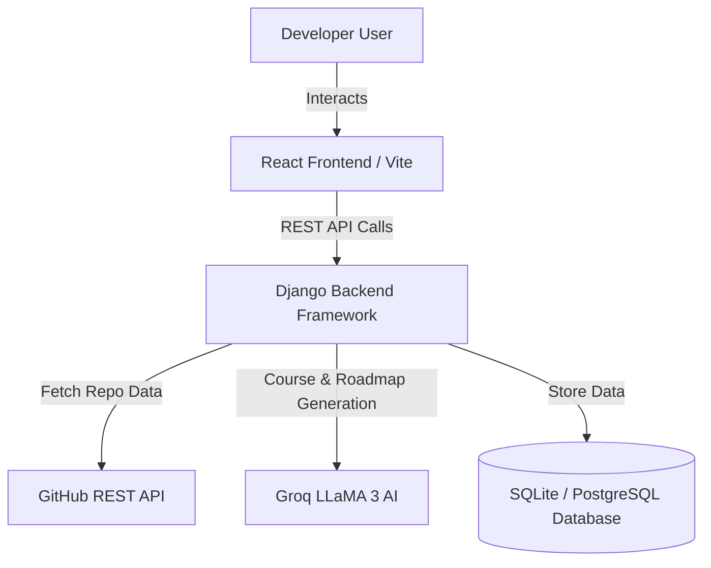

# 🧠 Nexora — Build Skills. Track Growth. Shape Your Future.

<p align="center">
  
  
  
  
  
  
</p>

Nexora is a state-of-the-art, **AI-powered Developer Skill Acceleration & Career Growth Platform**. By integrating deep GitHub code reviews, AI-generated custom roadmaps, an interactive course academy, mock interviews, and automated competency certifications, Nexora helps developers continuously identify skill gaps and track their progress on a unified, gamified dashboard.

---

## ⚡ Core Features

### 1. 🧠 AI Skill Gap Analyzer & Personalized Roadmaps
- Evaluates your profile, past coding challenge scores, mock interview transcripts, and connected GitHub code metrics.
- Uses **Groq Cloud LLaMA 3** to pinpoint weak areas (e.g. System Design, DevOps, or Frontend) and generate a **custom multi-week learning path** with dynamic progress metrics.

### 2. 🎓 Nexora Academy & Graded Quizzes
- Tapping any custom roadmap task (like *Docker Containerization* or *JWT Authentication*) opens a **fully detailed tutorial course** with concepts, architecture diagrams, and syntax-highlighted code guides.
- Verifies knowledge with an interactive **5-question graded quiz** (Basic, Intermediate, and Advanced). Getting a passing score auto-completes the roadmap item!

### 3. 🏆 Gamified Progress & Competency Certifications
- Completing a roadmap focus week automatically awards a **Subject Competency Certificate** (e.g., *Competency in System Design*) complete with a unique certificate ID (e.g., `NXR-E3A5B876`).
- Features a **Gamified XP & Rank Dashboard**: gain levels from "Explorer" up to "Master", maintain daily streaks, and log activities on an interactive dashboard.

### 4. 🐙 Lightning-Fast GitHub Health Scoring
- Connect your GitHub profile to scan your public repositories in **under 1.5 seconds** (utilizing concurrent `ThreadPoolExecutor` workers).
- Computes an overall **Code Health Score** based on language ratios, test directory coverage, repository complexity, and commit frequency.

### 5. 🎙️ AI Mock Interview Lab
- Simulates real-time interactive technical or HR interviews (FAANG SWE, Frontend, DevOps, Product, etc.).
- Evaluates developer responses, provides a comprehensive performance report, points out key improvements, and awards XP.

### 6. 💻 Hands-on Code Challenges
- Integrated coding sandbox with test runners, difficulty badges (Easy, Medium, Hard), and topics coverage.

### 7. 🎙️ Voice-Enabled AI Mentor (Dev Mentor)
- **Speech-to-Text Input:** Converts user spoken voice queries into chat text input in real-time.
- **Text-to-Speech Output:** Synthesizes assistant responses using browser-native Voice Speech Synthesis, complete with an AI markdown filter to speak clean sentences instead of raw formatting.

### 8. 🚀 Showcase AI VC Critic & Upvotes
- **Upvote/Likes integration:** Toggle project upvotes and track user recognition with micro-interaction counters.
- **Venture AI Critic Terminal:** Request detailed venture-capital pitch score analysis, code audits, and resume enhancement tips inside a vintage terminal emulator pane.

### 9. 🔔 Persistent Notification Center & Audio Chimes
- Real-time glassmorphic slide popover displaying persistent notifications (likes, challenge completion, level-ups).
- HTML5 Web Audio-powered game style sound alerts playing automatically when new notifications arrive.

### 10. 🔑 Google OAuth Sign-In & Sign-Up
- Google Client Single Sign-On popups rendering inside Login and Register screens.
- Safe token signature validation, account setup, and Django JWT exchange backends.

---

## 🛠️ Architecture & Tech Stack



*   **Frontend**: React (Vite, TailwindCSS, Framer Motion, Recharts, Lucide Icons).
*   **Backend**: Django, Django REST Framework (DRF), Simple JWT (Authentication).
*   **AI Engine**: Groq LLaMA 3 APIs for sub-100ms structured JSON outputs.
*   **APIs**: GitHub REST API (parallelized content scanning), Google Identity Services API.

---

## 🚀 Setup & Installation

### ⚡ One-Click Automatic Setup (Windows)
If you are on Windows, you can automate the entire setup:
1. Double-click **`install.bat`** in the root directory. This script will check if Python/NPM are installed, install all requirements, run database migrations, and configure frontend npm node modules.
2. Double-click **`run.bat`** to start both the Django backend and Vite development server, and automatically launch Nexora in your browser!

---

### Manual Setup

### Prerequisites
- Python 3.11+
- Node.js 18+

### 1. Backend Setup
Clone the repository and navigate to the backend directory:
```bash
cd backend
```

Create a virtual environment and install dependencies:
```bash
python -m venv venv
source venv/bin/activate  # On Windows use: venv\Scripts\activate
pip install -r requirements.txt
```

Create a `.env` file in the `backend/` directory:
```env
DEBUG=True
SECRET_KEY=your-django-secret-key
GROQ_API_KEY=your-groq-api-key
GITHUB_TOKEN=your-github-personal-access-token
```

Run database migrations and start the server:
```bash
python manage.py makemigrations
python manage.py migrate
python manage.py runserver
```
The API server will run at `http://127.0.0.1:8000/`.

---

### 2. Frontend Setup
Navigate to the frontend directory:
```bash
cd ../frontend
```

Install npm dependencies:
```bash
npm install
```

Create a `.env` file in the `frontend/` directory:
```env
VITE_API_URL=http://127.0.0.1:8000/api
```

Start the Vite development server:
```bash
npm run dev
```
Open your browser and navigate to `http://localhost:5173/`.

---

## 📁 Repository Structure

```
Nexora/
├── backend/
│   ├── core/                  # AI client integration (Groq, GitHub)
│   ├── roadmap/               # Learning roadmap & custom course models
│   ├── progress/              # XP systems, certificate engines, streaks
│   ├── challenges/            # Coding tasks & compiler runner
│   ├── interviews/            # Live interactive AI mock interview code
│   ├── users/                 # Authentication, User profiles, GitHub scan cache
│   └── config/                # Main Django configuration & routes
├── frontend/
│   ├── src/
│   │   ├── components/        # Layout wrappers (Navbar, UI cards)
│   │   ├── pages/             # Pages (RoadmapPage, LearnPage, ProfilePage, ProgressPage)
│   │   ├── services/          # API wrapper connections (roadmapService, authService)
│   │   └── App.jsx            # Main app router
│   └── package.json
└── README.md
```

---

## 📜 License
This project is licensed under the MIT License. See [LICENSE](LICENSE) for details.

---

<p align="center">
  Made with ❤️ by the Nexora Team
</p>
